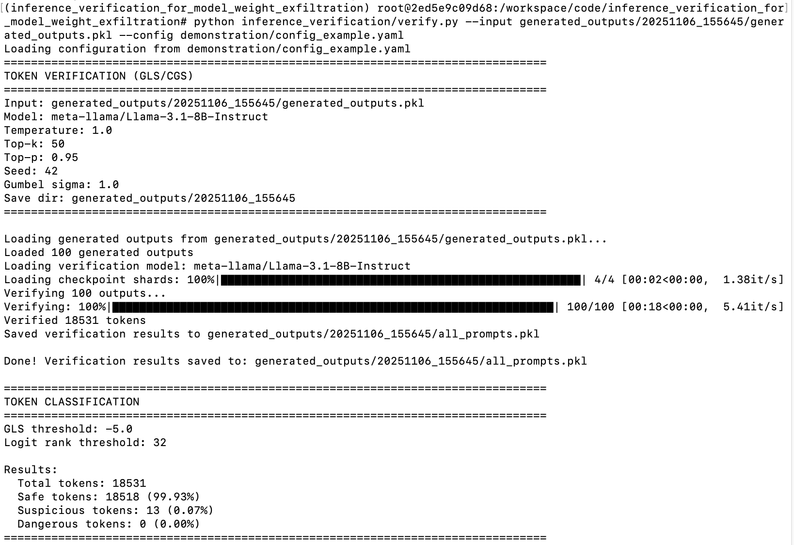

# Inference Verification to Detect Model Weight Exfiltration.

This repo is associated with [Verifying LLM Inference to Detect Model Weight Exfiltration](https://arxiv.org/abs/2511.02620)

As large AI models become increasingly valuable assets, the risk of model weight exfiltration from inference servers grows accordingly.
An attacker controlling an inference server may exfiltrate model weights by hiding them within ordinary model responses, a strategy known as steganography.
This work investigates how to **verify** LLM model inference to defend against such attacks and, more broadly, to detect anomalous or buggy behavior during inference. To enable verification, we characterize valid sources of non-determinism in large language model inference and introduce two practical estimators for them: one for inference that uses the Gumbel-Max Trick (GM-LS) and one for inference that uses Inverse Probability Transform (IPT-LS). This work develops these methods with a concurrent work, Token-DiFR, which has minor implementation differences, but focuses on the method development, rather than the application of these methods. 

<table>
<tr>
<td width="50%">
<b>The world we are hoping for:</b><br/>

</td>
<td width="50%">
<b>The world we want to protect against:</b><br/>

</td>
</tr>
</table>

In the paper, we 
1. Formalize model weight exfiltration as a security game,
2. Propose a verification framework that can provably mitigate steganographic exfiltration, 
3. Specify the trust assumptions associated with our scheme.
4. Give empirical bounds on exfiltratable information, from an information-theoretic perspective, such that no-adversary (regardless of their computational power) could exfiltrate more information
5. We evaluate our detection framework on several open-weight models ranging from 3B to 30B parameters. On MOE-Qwen-30B, our detector reduces exfiltratable information to <0.5% with false-positive rate of <0.01, corresponding to a >200x slowdown for adversaries.


*Our scheme:*


## Quick Start - *I just want to verify if my tokens are honestly generated!*

**Optional pre-step: Generate tokens**
```python 
python inference_verification/generate.py --config demonstration/config_example.yaml 
```

Verify tokens

```python
python inference_verification/verify.py 
      --input generated_outputs/generated_outputs.pkl 
      --config demonstration/config_example.yaml 
```

*You can verify 18,500 tokens in 17 seconds!*
Here is how the output will look:
```
Results:
  Total tokens: 18531
  Safe tokens: 18518 (99.93%)
  Suspicious tokens: 13 (0.07%)
  Dangerous tokens: 0 (0.00%)
```

*Screenshot of inference verification process (verify.py):*




## Quick Start - *I just want to verify those plots that you made!*

```bash
./scripts/test_minimal.sh
```

This will:
1. Generate text using vLLM (100 prompts, 100 tokens each)
2. Compute GLS/CGS verification scores
3. Produce Pareto frontier plots showing FPR vs extractable information trade-offs


### Multi-Model Sweep

For production experiments across multiple models:

```bash
cd scripts
./run_GLS_all_models.sh
```


## Repo Description

This repository contains code for inference verification applied to preventing model weight exfiltration. Specifically we implement the Gumbel Likelihood Score (GLS) and Convolved Gaussian Score (CGS) methods for verifying tokens generated by large language models when running inference using the Inverse Probability Transform and Gumbel-Max Trick.

**Note on terminology:** In the paper, these methods are referred to as:
- *Inverse Probability Transform (IPT) Likelihood Score (IPT-LS)* - implemented in the codebase as *Convolved Gaussian Score (CGS)*
- *Gumbel Max Likelihood Score (GM-LS)* - implemented in the codebase as *Gumbel Likelihood Score (GLS)*

 
## Code Contributors:
* Adam Karvonen
* Daniel Reuter
* Roy Rinberg


## Citation
```
@misc{rinberg2025verifyingllminferenceprevent,
      title={Verifying LLM Inference to Prevent Model Weight Exfiltration}, 
      author={Roy Rinberg and Adam Karvonen and Alexander Hoover and Daniel Reuter and Keri Warr},
      year={2025},
      eprint={2511.02620},
      archivePrefix={arXiv},
      primaryClass={cs.CR},
      url={https://arxiv.org/abs/2511.02620}, 
}
```
